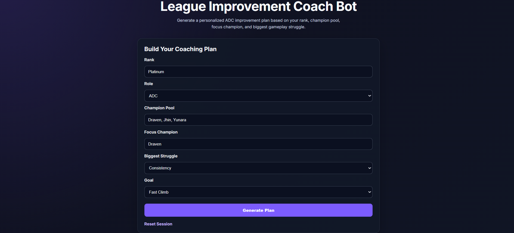
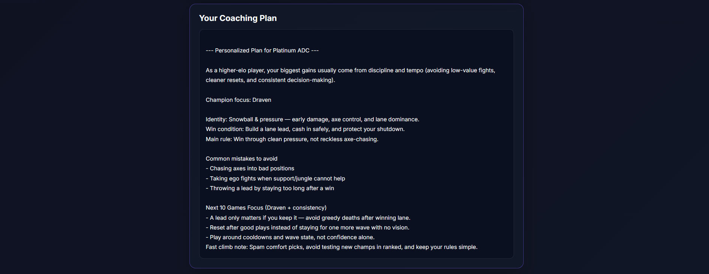
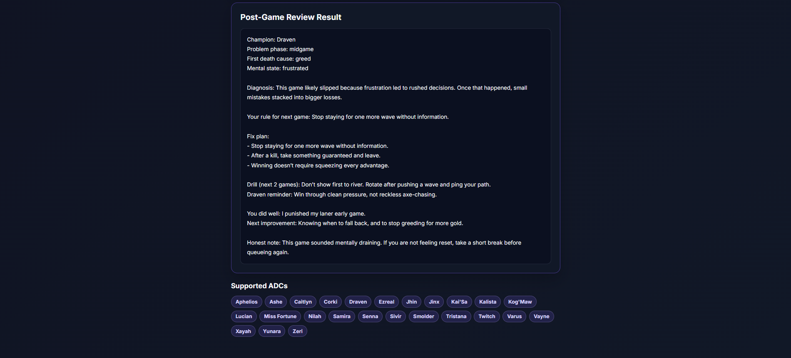

# League Improvement Coach Bot

A Flask web app that gives League of Legends ADC players personalized improvement plans based on their rank, champion pool, focus champion, and gameplay struggles.

The project started as a command-line Python coaching tool and was later expanded into a browser-based interface so users can generate coaching tips without running the program through the terminal.

## Overview

League Improvement Coach Bot is designed to help players focus on practical improvement habits instead of only looking at stats, builds, or match history data.

The app asks the user for their rank, role, champion pool, focus champion, biggest gameplay struggle, and improvement goal. Based on those inputs, it generates a simple coaching plan with champion-specific advice and “Next 10 Games” focus rules.

The project currently focuses on the ADC role, but it is designed to be expandable so future versions can support other roles such as Top, Jungle, Mid, and Support.

## Problem

Many League of Legends tools focus heavily on statistics, builds, or raw match data. While useful, those tools do not always explain what a player should actually focus on improving in their next few games.

Players often know they made mistakes after a loss, but they may not know whether the issue came from laning, midgame decisions, teamfighting, positioning, greed, tilt, or poor consistency.

## Solution

League Improvement Coach Bot acts as a lightweight improvement coach. It gives users clear, actionable advice based on their current situation instead of overwhelming them with too much information.

The goal is to give players a few simple rules they can follow over their next set of games.

## Features

* Flask web interface for generating coaching plans
* Rank-aware coaching based on player skill level
* Champion-specific advice for multiple ADC champions
* User-selected focus champion
* Personalized “Next 10 Games” improvement plans
* Post-game review form with structured reflection questions
* Session reset option
* Supported ADC list displayed on the web page
* Fallback general ADC plan for unsupported inputs
* Designed for future expansion to other roles

## Supported Champions

The bot currently supports ADC champions such as:

* Aphelios
* Ashe
* Caitlyn
* Corki
* Draven
* Ezreal
* Jhin
* Jinx
* Kai'Sa
* Kalista
* Kog'Maw
* Lucian
* Miss Fortune
* Nilah
* Samira
* Senna
* Sivir
* Smolder
* Tristana
* Twitch
* Varus
* Vayne
* Xayah
* Yunara
* Zeri

Each champion includes advice based on their identity, win condition, common mistakes, and focus areas such as laning, midgame, teamfights, and consistency.

## Screenshots

### Coaching Plan Form



### Generated Coaching Plan



### Post-Game Review



## Tech Stack

* **Python**
* **Flask**
* **HTML**
* **CSS**
* **Git**
* **GitHub**

## Project Structure

```text
league-improvement-coach/
│
├── screenshots/
│   ├── home.png
│   ├── plan.png
│   └── review.png
│
├── src/
│   ├── app.py
│   ├── main.py
│   ├── coach.py
│   ├── champions.py
│   │
│   ├── templates/
│   │   └── index.html
│   │
│   └── static/
│       └── style.css
│
├── README.md
├── requirements.txt
└── .gitignore
```

## How It Works

1. The user enters their rank, role, champion pool, focus champion, biggest struggle, and improvement goal.
2. The Flask app collects the form data from the browser.
3. A player profile is created using the user's inputs.
4. The app applies rank-aware coaching logic.
5. If the selected champion is supported, the app generates champion-specific advice.
6. The user can complete a post-game review to reflect on mistakes and receive a focused rule for the next game.

## How to Run Locally

Clone the repository:

```bash
git clone https://github.com/mattlacson/league-improvement-coach
```

Move into the project folder:

```bash
cd league-improvement-coach
```

Install the required package:

```bash
pip install -r requirements.txt
```

Run the Flask app:

```bash
python src/app.py
```

Open the local site in your browser:

```text
http://127.0.0.1:5000
```

## Example Use Case

A player enters:

```text
Rank: Platinum
Role: ADC
Champion Pool: Jhin, Vayne, Jinx
Focus Champion: Jhin
Biggest Struggle: Consistency
Goal: Fast Climb
```

The app generates a focused improvement plan with Jhin-specific advice, common mistakes to avoid, and simple rules to follow over the next 10 games.

## Design Decisions

* A Flask web interface was added so users can interact with the app through a browser.
* ADC was chosen as the first role focus to keep the advice specific and useful.
* Champion advice is stored in reusable Python data structures to make it easier to add or update champions.
* The app uses rule-based coaching logic instead of machine learning so the advice stays simple and predictable.
* Post-game review questions were added to help users turn losses into specific improvement goals.

## Limitations

* No live Riot API integration
* No real match history analysis
* Advice is based on rule-based coaching logic, not player statistics
* The app currently focuses mainly on ADC gameplay
* The web app currently runs locally unless deployed separately

## Future Improvements

* Add support for other roles such as Top, Jungle, Mid, and Support
* Create role-specific coaching plans for wave management, jungle pathing, roaming, vision control, objective setup, and teamfight responsibilities
* Add more champions for each role
* Add Riot API integration for match-history-based recommendations
* Save player profiles between sessions
* Track improvement goals across multiple games
* Add matchup-specific advice
* Add a database for storing player reviews and improvement history
* Deploy the Flask app online for a live demo

## Status

The current version is a working local Flask web app with ADC-focused coaching plans, champion-specific advice, and a post-game review feature.
